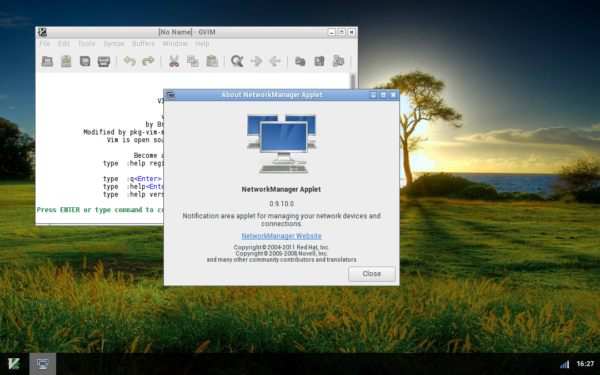

## tint3 is a lightweight X11 panel

Born as a fork and C++ port of tint2, tint3 retains backwards compatibility and
provides a cleaner code base and better stability.
Visit [github.com/jmc-88/tint3](https://github.com/jmc-88/tint3)
for more information.

## packages

Packages provided here are for tint3 **v0.1.0**.

<!-- Important! No spaces between anchors, or Markdown will render them in
     separate 
 tags, breaking the alignment -->
<a class="package" target="source"
   href="https://github.com/jmc-88/tint3/releases/tag/v0.1.0">
  
  source
</a>
<a class="package" target="aur"
   href="https://aur.archlinux.org/packages/tint3-cpp-git">
  
  aur+git
</a>
<a class="package" href="https://github.com/jmc-88/tint3/releases/download/v0.1.0/tint3-0.1.0-amd64.deb">
  
  amd64
</a>
<a class="package" href="https://github.com/jmc-88/tint3/releases/download/v0.1.0/tint3-0.1.0-amd64.rpm">
  
  amd64
</a>

## screenshots

